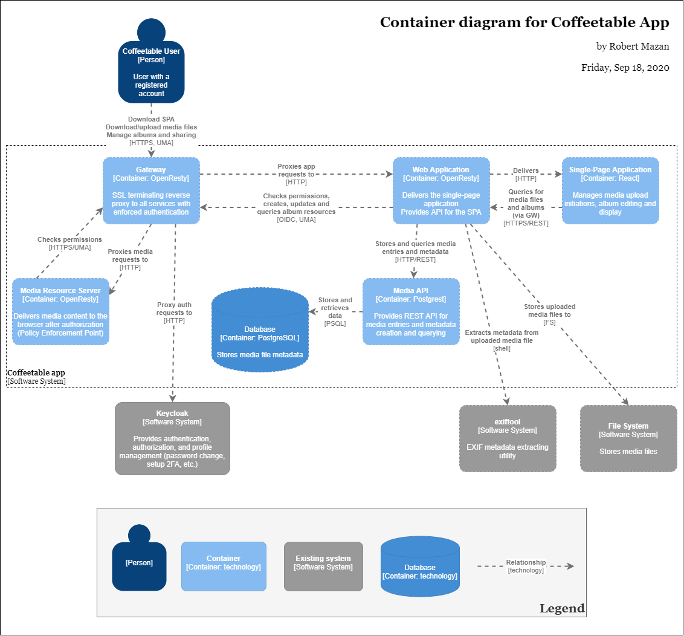

# Solution Architecture Document

<!-- START doctoc generated TOC please keep comment here to allow auto update -->
<!-- DON'T EDIT THIS SECTION, INSTEAD RE-RUN doctoc TO UPDATE -->
**Table of Contents**

- [Solution Architecture Document](#solution-architecture-document)
  - [Introduction](#introduction)
    - [Goals](#goals)
    - [Definitions, acronyms, abbrevations](#definitions-acronyms-abbrevations)
  - [Technology choices](#technology-choices)
  - [Solution architecture overview](#solution-architecture-overview)
    - [System context](#system-context)
      - [Keycloak](#keycloak)
      - [File system](#file-system)
      - [exiftool](#exiftool)
    - [System components](#system-components)
      - [Web application](#web-application)
      - [Media API](#media-api)
      - [Media Resource Server](#media-resource-server)
      - [Authentication Proxy](#authentication-proxy)
      - [Single-Page Application](#single-page-application)
    - [Data model](#data-model)
  - [Deployment approaches](#deployment-approaches)

<!-- END doctoc generated TOC please keep comment here to allow auto update -->

## Introduction

### Goals

### Definitions, acronyms, abbrevations

Abbrevation/acronym | Description
--------------------|------------
OIDC                | OpenID Connnect (see [specifications](https://openid.net/connect/))
UMA                 | User Managed Access (see [UMA FAQ](https://kantarainitiative.org/confluence/display/uma/UMA+FAQ))
2FA                 | Two-factor authentication
Exif                | Exchangeable image file format

## Technology choices

## Solution architecture overview

### System context

#### Keycloak

#### File system

#### exiftool

### System components

#### Web application

#### Media API

#### Media Resource Server

#### Authentication Proxy

#### Single-Page Application

### Data model

## Deployment approaches
