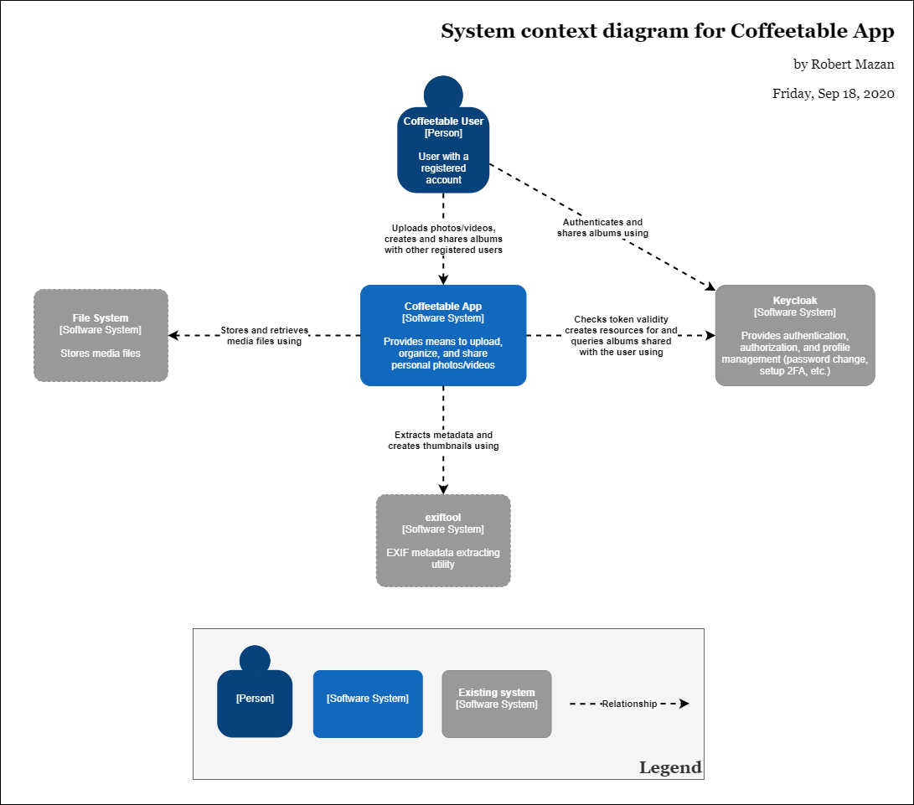

# Solution Architecture Document

<!-- START doctoc generated TOC please keep comment here to allow auto update -->
<!-- DON'T EDIT THIS SECTION, INSTEAD RE-RUN doctoc TO UPDATE -->
**Table of Contents**

- [Introduction](#introduction)
  - [Goals](#goals)
  - [Definitions, acronyms, abbreviations](#definitions-acronyms-abbreviations)
- [High-level requirements](#high-level-requirements)
- [Technology choices](#technology-choices)
  - [OpenResty](#openresty)
  - [PostgreSQL and Postgrest](#postgresql-and-postgrest)
  - [Keycloak](#keycloak)
- [Solution architecture overview](#solution-architecture-overview)
  - [System context](#system-context)
    - [Keycloak](#keycloak-1)
    - [File system](#file-system)
    - [exiftool](#exiftool)
  - [System components](#system-components)
    - [Web application](#web-application)
    - [Media API](#media-api)
    - [Media Resource Server](#media-resource-server)
    - [Authentication Proxy](#authentication-proxy)
    - [Single-Page Application](#single-page-application)
  - [Data model](#data-model)
- [Deployment approaches](#deployment-approaches)

<!-- END doctoc generated TOC please keep comment here to allow auto update -->

## Introduction

This project came from the frustration that none of the existing solutions were completely suitable for sharing personal media files (photos and videos) within the family. Either the UX or privacy concerns, or simply too slow when self-hosted on a Raspberry Pi.

### Goals

Provide means to upload, organize, and share personal photos and videos between family members.

The solution should work with acceptable performance on a Raspberry Pi.

### Definitions, acronyms, abbreviations

Abbreviation/acronym | Description
-------------------- |------------
OIDC                 | OpenID Connect (see [specifications](https://openid.net/connect/) )
UMA                  | User-Managed Access (see [UMA FAQ](https://kantarainitiative.or g/confluence/display/uma/UMA+FAQ))
2FA                  | Two-factor authentication
Exif                 | Exchangeable image file format

## High-level requirements

Users with viewing privileges only must be able to:

* View contents of the albums shared with them

Users who are authorized to do uploads have the same privileges as viewers plus they must be able to:

* Upload photos and videos
* View uploaded media files ordered by either date taken or date uploaded
* View uploaded media files without grouping or grouped by date ("Daily", "Monthly" view) or grouped by location
* Remove media from Photostream (/w trashbin functionality)
* Create albums and add media from their Photostream
* Remove media files from albums
* Contribute to albums shared with them if album editing was permitted
* Change the order media is shown in an album
* Select cover photo for the album
* Edit album title

## Technology choices

### OpenResty

As performance is a key factor the motivation was to pick a middleware with the least possible overhead. OpenResty is based on the highly performant Nginx server so it seems to be a reasonable choice. This was the first technical choice made, rest is built around.

### PostgreSQL and Postgrest

PostgreSQL is a leading DB on its own, but with Postgrest it really shines in this context. This setup makes it possible to not just easily store data, but Postgrest provides the means to easily run relatively complex queries using a REST API. These endpoints can be exposed (in a restricted way) to the client, so the single-page application can retrieve data filtered, grouped, and paginated without the need to introduce any code to do so.

### Keycloak

Keycloak is a pretty standard solution to manage user authentication and authorization. For the authentication part, it supports OIDC, and this way it can be used easily with OpenResty (thanks to the `lua-resty-openidc` package), and Postgrest supports JWTs out of the box.

For the authorization User-Managed Access (UMA for short) is a standard gaining more and more popularity as it provides full privacy visibility and control for the users above their resources. As Keycloak implements UMA it can cover the authorization part completely.

## Solution architecture overview

### System context

#### Keycloak

Keycloak's responsibilities are:

* Authenticating users
* Validating tokens on requests from OpenResty and Postgrest
* Validate requests for media files if the current user can access them
* Provides information about owned and shared albums to OpenResty
* Providing means for users to share albums (MVP is just using the built-in UI, later either the UI can be themed or we can go with a fully customized UI and use only the API provided by Keycloak)

#### File system

This is where media files are stored. Theoretically, they could be stored directly in the database, but that would increase the DB dump size greatly, which would be using too much space in this case unnecessarily - there are better solutions to backup files without this kind of disk space consumption like for example syncing folder contents to a versioned S3 bucket on AWS.

#### exiftool

A command-line tool that is used to extract metadata from media files. This data (after some normalization) will be stored in the database.

### System components

#### Web application

#### Media API

#### Media Resource Server

#### Authentication Proxy

#### Single-Page Application

### Data model

## Deployment approaches
